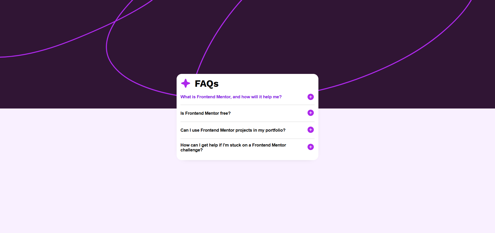

# Frontend Mentor - FAQ accordion

This is a solution to the [FAQ accordion challenge on Frontend Mentor](https://www.frontendmentor.io/challenges/faq-accordion-wyfFdeBwBz).Frontend Mentor challenges help you improve your coding skills by building realistic projects. Below, you can find links to explore the project further.

The **Live Site** link will take you to the fully functional version of the recipe page, while the **Design Preview** link lets you see how the final implementation compares to the intended design. The **Mobile Design Preview** link allows you to see how the design looks specifically on mobile devices. Additionally, the **Active States Preview** link will show the visual design of the active states applied to interactive elements on the page.

## Screenshot

## Links

- **Live Site:** [Check out the live website](https://csekerobi.github.io/frontendmentor-challenges/faq-accordion/)
- **Design Preview:** [View the design preview](./design/desktop-design.jpg)
- **Mobile Design Preview:** [View the mobile design version](./design/mobile-design.jpg)
- **Active States Preview**: [View the active states design](./design/active-states.jpg)

## Built with

- Semantic HTML5 markup
- CSS custom properties
- Flexbox
- CSS Grid
- Vanilla JavaScript
