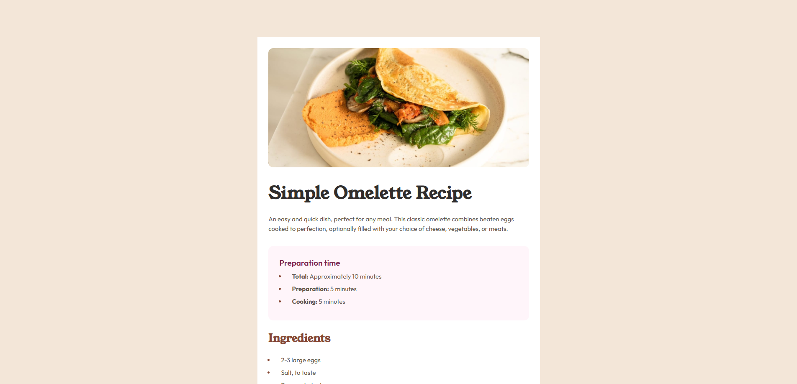

# Frontend Mentor - Recipe page solution

This is a solution to the [Recipe page challenge on Frontend Mentor](https://www.frontendmentor.io/challenges/recipe-page-KiTsR8QQKm). Frontend Mentor challenges help you improve your coding skills by building realistic projects. Below, you can find links to explore the project further.

The **Live Site** link will take you to the fully functional version of the recipe page, while the **Design Preview** link lets you see how the final implementation compares to the intended design. Additionally, the **Mobile Design Preview** link allows you to see how the design looks specifically on mobile devices.

## Screenshot

## Links

- **Live Site:** [Check out the live website](https://csekerobi.github.io/frontendmentor-challenges/recipe-page/)
- **Design Preview:** [View the design preview](./design/desktop-design.jpg)
- **Mobile Design Preview:** [View the mobile design version](./design/mobile-design.jpg)

## Built with

- Semantic HTML5 markup
- CSS custom properties
- Flexbox
- CSS Grid
